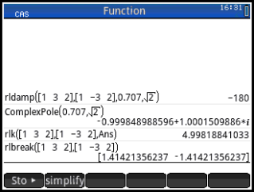
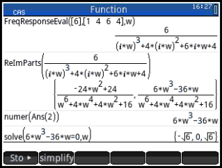
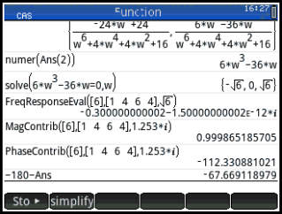

# ControlsHelpers
My HP Prime Helper Functions for Control Systems Analysis

## Directions
1. Update your firmware. 
2. Drag the `*.hpprgm` into Programs directory. 
3. Rename the program by deleting the "Local" word in the filename.

## Usage

### SecondOrderSystem
- `DampingRatio(os)` calculates the damping ratio zeta for a given
  overshoot percentage (expressed as a fraction of 1)
- `Overshoot(zeta)` calculates the overshoot (expressed as a fraction
  of 1) given a damping ratio
- `PeakTime(zeta,omega)` calculates the peak time of a second-order system given a `zeta` and `omega`
  input.
- `RiseTime(zeta,omega)` calculates the rise time of a second-order system given a
  `zeta` and `omega` input. Note the result is a third-order
  polynomial estimate due to the absence of a closed-form solution.
- `SettlingTime(zeta,omega)` calculates the settling time of a second-order system
  given a `zeta` and `omega` input.
- `PeakMagnitude(zeta)` calculates the peak magnitude of a second-order
  open-loop system given `zeta` input
- `PeakFrequency(zeta,omega)` calcaultes the frequency at the peak magnitude of a
  second-order open-loop system given `zeta` and `omega` input
- `Bandwidth(zeta,omega)` calculates the bandwidth of a second-order open-loop
  system given `zeta` and `omega`.
- `PhaseMargin(zeta)` calculates the phase margin of a second-order
  open-loop system given `zeta`.

### RootLocus

- `rldamp(numerator, denominator, zeta, radius)` calculates the total angle
  contributions of a critical point for an open-loop transfer function
  with polynomial coefficients `numerator` and `denominator` to a point given by
  damping ratio `zeta` and polar radius `radius`. This program is
  mainly used to check whether a given point in the complex plane lies
  on the root locus. The inputs `numerator` and `denominator` are row
  matrices consisting of the coefficients of the relevant polynomials
  in decreasing power, so [1 2 3] corresponds to the coefficients of
  the polynomial x^2 + 2x + 3.

- `rlk(numerator, denominator, complex_point)` calculates the required
  gain for the open-loop transfer function with polynomial coefficients
  `numerator` and `denominator` to realize a pole of `complex_point`,
  expressed as `a+b*i`. For example, after using rldamp to confirm the
  exist of a pole, its coordinates can be converted to Cartesian via:
  
  ```
  radius*cos(180-acos(zeta)) + radius*sin(180-acos(zeta))*i
  ```

- `rlbreak(numerator, denominator)` calculates breakaway and
  break-in points for the for an open-loop transfer function
  with polynomial coefficients `numerator` and `denominator`. It
  accomplishes this by solving for the zeros of dK/ds =
  d(-P(s)/Q(s))/ds, where T(s) = Q(s)/P(s). 

### Frequency Response
- `ReImParts(expression)` generates a list where the first entry is
  the real component and second entry is the imaginary component of
  any expression. 
- `Mag(expression)` calculates the magnitude of a frequency response function
- `Phase(expression)` calculates the phase of a frequency
  response function
- `FreqResponseEval(num, den, omega)` evaluates the frequency
  response G(j*omega) of  a transfer function with `num`,`den` being
  the coefficients of its numerator and denominator respectively
- `MagContrib(num, den, c)` evaluates the magnitude of a frequency
  response given a complex point `c` and transfer function coefficients
- `PhaseContrib(num, den, c)` evaluates the phase of a frequency
  response given a complex point `c` and transfer function
  coefficients
  

### Third Party Software
The following are mirrors of applications from the HP Developer website:

- Control Systems Application
- Routh Hurwitz

### Root Locus - Integrated Example

Consider the unity feedback loop with forward transfer function
```
        K(s+1)(s+2)
G(s) = ------------
        (s-1)(s-2)
```
Calculate the value of K that yields a stable system with a pair of
  second-order poles that have a damping ratio of 0.707. Where are
  the break-in and breakaway points?

To find the damping ratio of 0.707 and find the second-order poles. We
can search the line at angle `pi - acos(0.707)` for different values
of `radius` with the command
```
rldamp([1 3 2],[1 -3 2],0.707,sqrt(2)]
                                    -180.0
```
This implies a radius of sqrt(2) is needed for the overshoot line of
0.707 zeta to intersect the root locus. The associated gain is
```
rlk([1 3 2],[1 -32],sqrt(2)*cos(180-acos(0.707))+sqrt(2)*sin(180-acos(0.707))*i)
                                    4.9981
```
Finally, the breakaway and break-in points are
```
rlbreak([1 3 2],[1 -3 2])
                                    [1.41421356237 -1.41421356237]
```



### Frequency Response - Integrated Example
Consider the unity feedback system with the forward transfer function
```
              6
G(s) = ---------------
       (s^2+2s+2)(s+2)
```
Find the gain and phase margin.

To find the gain margin, we first find where the Nyquist diagram
crosses the real axis for frequency between 0 and positive infinity.

We can do this by first evaluating the frequency response with a
variable, converting it to complex form, and setting the imaginary
part equal to zero and solving the the real part. We get a real part
of -0.3. Thus K can be increased 3.33 before the real part becomes -1,
and the gain margin Gm = 20 log 3.33 = 10.45 dB.

The phase margin can be found by searching positive frequencies that
give a magnitude of unity. This frequency of 1.253 rad/s is then used to calculate
the total phase contribution, which is -112.3 degrees. This results in
a phase margin of -180 - (-112.3) = 67.7 degrees.



